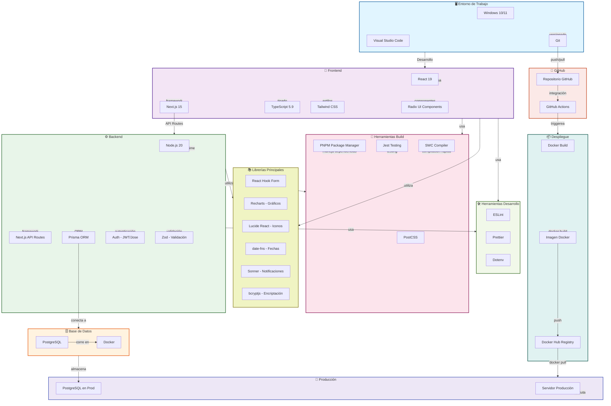

# Arquitectura de Aplicación - Pollería Gerson

Diagrama de arquitectura completo del proyecto con todas las herramientas y tecnologías utilizadas.



## 📋 Descripción de Componentes

### 🖥️ Entorno de Trabajo
- **Windows 10/11**: Sistema operativo de desarrollo
- **Visual Studio Code**: IDE principal
- **Git**: Control de versiones local

### 🎨 Frontend (Capa de Presentación)
- **React 19**: Librería de componentes
- **Next.js 15**: Framework fullstack con SSR
- **TypeScript**: Tipado estático
- **Tailwind CSS**: Estilos utilitarios
- **Radix UI**: Componentes accesibles

### ⚙️ Backend (API & Lógica)
- **Node.js 20**: Runtime de JavaScript
- **Next.js API Routes**: Endpoints HTTP
- **Prisma ORM**: Gestión de base de datos
- **Jose**: Autenticación JWT
- **Zod**: Validación de esquemas

### 🗄️ Base de Datos
- **PostgreSQL**: SGBDR robusto
- **Docker**: Contenedor para la BD

### 🔧 Herramientas Build
- **PNPM**: Gestor de paquetes (más rápido que npm)
- **Jest**: Framework de testing
- **SWC**: Compilador rápido de JavaScript
- **PostCSS**: Procesamiento de CSS

### 📚 Librerías Principales
- **React Hook Form**: Gestión de formularios
- **Recharts**: Gráficos de datos
- **Lucide React**: Iconografía
- **date-fns**: Manipulación de fechas
- **Sonner**: Sistema de notificaciones Toast
- **bcryptjs**: Encriptación de contraseñas

### 📌 GitHub & CI/CD
- **Repositorio GitHub**: Alojamiento del código
- **GitHub Actions**: Automatización de pipeline

### 📦 Despliegue
- **Docker Build**: Creación de imágenes
- **Docker Hub**: Registro de imágenes
- **Servidor Producción**: Ejecución de la app

---

## 🔄 Flujo de Desarrollo Completo

```
1. Desarrollador en Windows hace cambios en VS Code
                    ↓
2. Comete con Git y push a GitHub
                    ↓
3. GitHub Actions ejecuta workflow automáticamente
                    ↓
4. Se ejecutan tests (Jest) y build (SWC)
                    ↓
5. Docker construye la imagen (Dockerfile)
                    ↓
6. La imagen se publica en Docker Hub
                    ↓
7. Servidor de producción descarga la imagen
                    ↓
8. PostgreSQL en producción se sincroniza
                    ↓
9. App está disponible para usuarios
```

---

## 🛠️ Stack Tecnológico Resumen

| Aspecto | Tecnología |
|--------|------------|
| **SO Desarrollo** | Windows 10/11 |
| **Lenguaje** | TypeScript / JavaScript |
| **Frontend Framework** | Next.js + React |
| **Estilos** | Tailwind CSS + Radix UI |
| **Backend** | Node.js + Next.js API Routes |
| **BD** | PostgreSQL + Prisma ORM |
| **Contenedores** | Docker |
| **Gestor Paquetes** | PNPM |
| **Testing** | Jest |
| **Versionado** | Git + GitHub |
| **Auth** | JWT (Jose) |
| **Encriptación** | bcryptjs |
