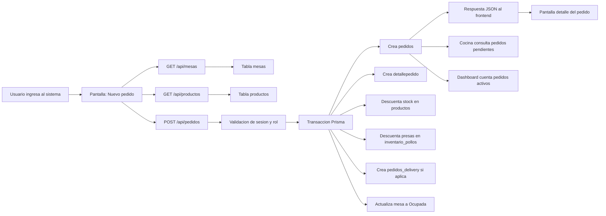
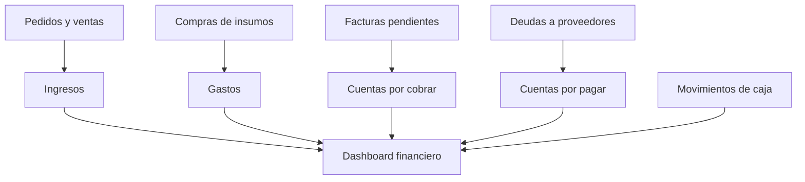

# Flujo de datos y datos de demostracion

Este proyecto usa Next.js para la interfaz y las rutas API, Prisma como capa de acceso a datos y PostgreSQL como base de datos. Los datos de prueba se cargan desde `prisma/seed.ts`.

## Como cargar datos demo

1. Verificar que `DATABASE_URL` exista en `.env` o `.env.local`.
2. Ejecutar migraciones si la base esta vacia:

```bash
npm run db:deploy
```

3. Cargar datos de ejemplo:

```bash
npm run db:seed
```

4. Iniciar el sistema:

```bash
npm run dev
```

## Usuarios de prueba

| Rol | Correo | Contrasena |
| --- | --- | --- |
| Admin | `admin@gerson.com` | `Admin123!` |
| Mesero | `mesero@gerson.com` | `Mesero123!` |
| Cocinero | `cocinero@gerson.com` | `Cocinero123!` |
| Cajero | `cajero@gerson.com` | `Cajero123!` |

## Datos agregados

El seed agrega informacion suficiente para demostrar el sistema completo:

| Modulo | Tablas principales | Ejemplos cargados |
| --- | --- | --- |
| Usuarios | `usuarios` | Admin, mesero, cocinero y cajero |
| Salon | `mesas` | Mesas 1 a 6, mesa delivery y mesa para llevar |
| Carta | `productos` | Pollo a la brasa, mostrito, bebidas y acompanamientos |
| Inventario | `insumos`, `inventario_pollos` | Pollos, papas, aceite, carbon, cremas y stock diario de presas |
| Pedidos | `pedidos`, `detallepedido`, `pedidos_delivery`, `detalle_pollos_pedido` | Un pedido de mesa y un pedido delivery |
| Finanzas | `ingresos`, `gastos`, `facturas`, `cuentas_por_cobrar`, `cuentas_por_pagar`, `presupuestos`, `movimientos_caja` | Ventas, compras, factura pendiente y caja |

## Flujo principal: crear pedido



## Lectura del flujo por capas

| Capa | Archivo o ruta | Funcion |
| --- | --- | --- |
| Interfaz | `components/nuevo-pedido-form.tsx` | Captura mesa, tipo de servicio, productos, cantidades y datos de cliente |
| API | `app/api/pedidos/route.ts` | Valida usuario, valida datos, crea pedido y detalles en una transaccion |
| Datos | `prisma/schema.prisma` | Define tablas y relaciones |
| Base de datos | PostgreSQL | Guarda pedidos, detalle, stock, mesas, finanzas e inventario |
| Vista posterior | `app/pedidos/[id]/page.tsx`, `app/cocina/page.tsx`, `app/dashboard/page.tsx` | Muestran el resultado del pedido creado |

## Flujo de stock

Cuando se registra un pedido:

1. El frontend envia los productos seleccionados y las presas de pollo.
2. La API busca cada producto con bloqueo de fila (`FOR UPDATE`) para evitar ventas simultaneas sobre el mismo stock.
3. Si no hay stock suficiente, la API devuelve error y no guarda el pedido.
4. Si hay stock, descuenta `productos.stock_produc`.
5. Si se seleccionaron presas, descuenta `inventario_pollos.pechos_disponibles` y `inventario_pollos.piernas_disponibles`.
6. Se crean registros en `detallepedido` y `detalle_pollos_pedido`.

## Flujo financiero



El modulo de finanzas consolida ventas, gastos, cuentas, presupuestos y movimientos de caja. Esto permite explicar que el dato no se queda en el formulario: pasa a reportes y resumenes para tomar decisiones.

## Ejemplo para exponer

1. Entrar como mesero: `mesero@gerson.com`.
2. Abrir `Pedidos` y crear un pedido para una mesa.
3. Seleccionar productos y presas de pollo.
4. Guardar el pedido.
5. Mostrar que el pedido aparece en `Pedidos` y `Cocina`.
6. Mostrar que la mesa cambia a ocupada.
7. Mostrar que el stock de productos y pollos baja.
8. Entrar como admin o cajero para ver el dashboard y finanzas.

## Resumen corto para el profesor

El sistema captura datos desde formularios de Next.js, los envia a rutas API internas, valida permisos con sesion, procesa reglas de negocio con Prisma y guarda los cambios en PostgreSQL. Luego esos mismos datos se consultan desde otras pantallas como cocina, dashboard, inventario y finanzas, demostrando un flujo completo de entrada, procesamiento, almacenamiento y salida.
