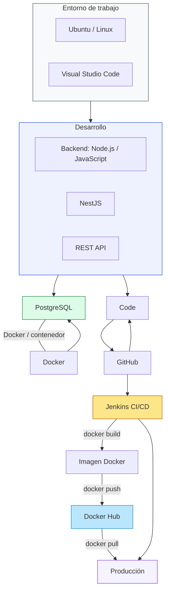

# Arquitectura de Aplicación

Este diagrama muestra una arquitectura de la app `Aplicaci-n-web-Gerson-main` y su flujo de desarrollo, similar al esquema que compartiste.

## Descripción
- `Ubuntu` y `VS Code` representan tu entorno local de desarrollo.
- `Node.js` y `NestJS` son el stack backend.
- `PostgreSQL` corre en contenedor Docker.
- `GitHub` se usa para versionar el código.
- `Jenkins` construye y publica imágenes Docker.
- El entorno de producción descarga las imágenes desde `Docker Hub`.
